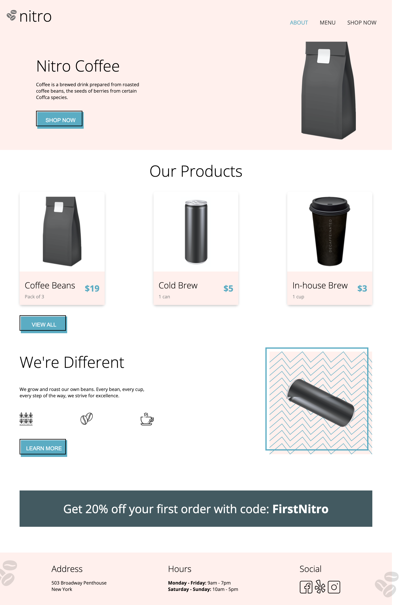
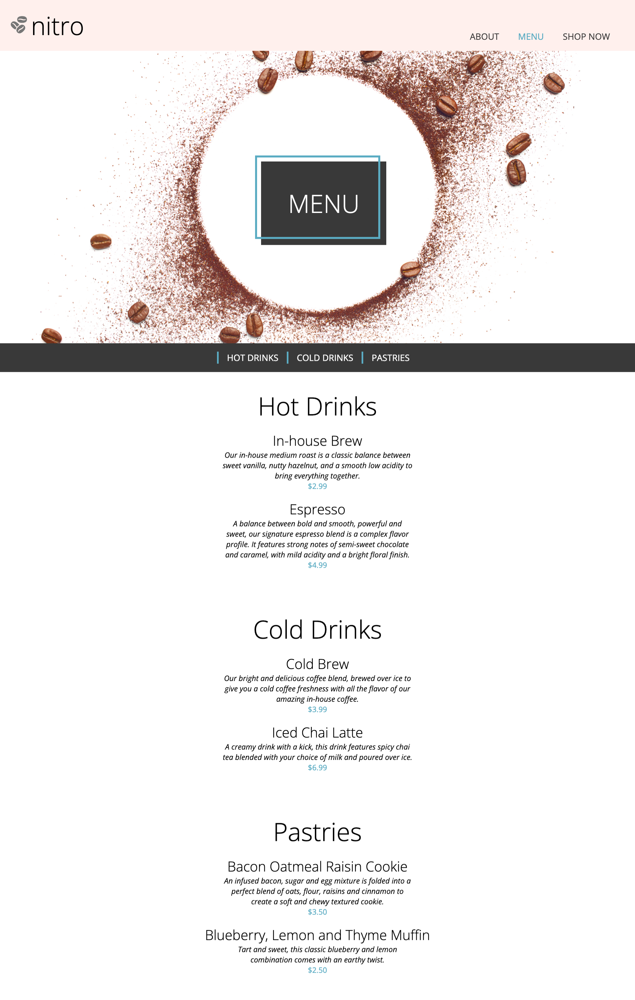

# ☕ Nitro Coffee Shop Website

A stylish marketing website for a fictional coffee shop, **Nitro**, built with HTML and SCSS. The site features a modern UI with animations and highlights products, promotions, and store details.





## Features

- 🖼️ Hero banner with promotional content
- 🛍️ Product showcase with price and unit
- 🔁 Button press animation and rotating image effect
- 💸 Discount banner with flashing animation
- 📍 Store address, business hours, and social media links
- 🔧 Modular SCSS architecture using partials and variables

## Tech Stack

- HTML5
- SCSS (Modular structure with `@use`)
- CSS Animations (`@keyframes`)
- Google Fonts (`Open Sans`)

## Local Setup

To run locally:

    1. Clone the repo:
    ```bash
    git clone https://github.com/Celinezzzzz/coffee_shop_website.git
    cd coffee_shop_website

    2. Open index.html in your browser.
